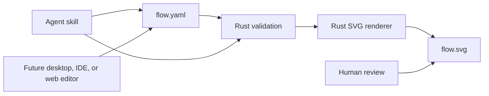

# Design Flow brainstorming and delivery strategy

## The problem to solve first

Design Flow is a constrained, agent-native diagram format:

```text
YAML manifest → validation → deterministic SVG
```

The main question is not which user interface to build first. It is how a human
and an agent can reliably share one diagram, revise it, and see the same result.

The source of truth remains the YAML manifest. SVG is a cheap, disposable
artifact for human review. No delivery option should create a second source of
truth.

## Principles

- A diagram must be useful with no GUI installed.
- An agent must be able to create, edit, validate, and render a diagram using
  normal workspace files and commands.
- A human must be able to open one artifact and understand the flow quickly.
- Output must be deterministic: unchanged YAML produces unchanged SVG.
- The first format must be intentionally restrictive: fixed grid, predefined
  node types and sizes, simple arrows, and clear validation errors.
- The format describes a diagram, not arbitrary executable automation.
- Every richer interface is a client of the same YAML and renderer contract.

## Delivery options

### 1. Rust CLI renderer and validator

```text
flow validate path/to/flow.yaml
flow render path/to/flow.yaml --output path/to/flow.svg
```

This is the smallest useful product. It makes Design Flow available to people,
agents, CI, desktop clients, IDEs, and web services without coupling the format
to any one of them.

| Benefits | Costs / limits |
| --- | --- |
| Works in a workspace, terminal, CI, and agent harness immediately. | Requires a user to open the SVG separately. |
| Makes validation and rendering testable before any GUI exists. | Does not provide drag-and-drop editing. |
| Creates simple file artifacts that are easy to commit, diff, and share. | Initial UX is command-oriented. |
| One implementation can power every later interface. | Needs a clear error format and stable CLI contract. |

Recommendation: build this first.

### 2. Agent harness skill

A skill file can teach an agent how to work with the CLI:

```text
Read the current flow YAML.
Make the requested manifest change.
Run validation.
Render an SVG into the workspace.
Show the artifact path and summarize the manifest diff.
```

The skill is not a renderer and must not reimplement layout, validation, or the
manifest schema. It is a repeatable operating procedure over the canonical CLI.

| Benefits | Costs / limits |
| --- | --- |
| Gives agents an explicit, reliable edit-render-review loop. | Depends on the CLI already being installed and discoverable. |
| Lets an agent “summon” a current visual artifact for a user. | A skill is harness-specific packaging, not a universal protocol. |
| Keeps the agent’s work visible as YAML and SVG files. | Does not replace human product decisions or visual review. |
| Cheap to add once command behavior is stable. | Needs versioning when the CLI/schema changes. |

Recommendation: ship directly after the CLI foundation. The first user-facing
agent experience can be “edit the flow and render `flow.svg` next to it.”

### 3. Rust desktop client and renderer

An `egui`/`eframe` application can load and save YAML, display the grid, snap
nodes into allowed positions, edit labels, connect valid ports, and invoke the
same validation and SVG-rendering library.

```text
Rust library
├── manifest parsing and validation
├── grid and routing rules
└── SVG rendering

Rust desktop application
└── constrained editor over the library
```

| Benefits | Costs / limits |
| --- | --- |
| Fastest path to a local visual authoring experience. | Requires a significantly larger interaction design and test surface. |
| Can enforce the restricted grammar while users drag and connect nodes. | `egui` accessibility and polished text editing may be less mature than a web UI. |
| Works offline and can be packaged for Omarchy. | Does not make the protocol more agent-native than the CLI does. |
| Reuses the exact Rust core. | Premature if most flows are created by agents or text edits. |

Recommendation: build only after the CLI + skill show that manually positioning
nodes in YAML is a real usability bottleneck.

### 4. IDE integration

An IDE integration should be thin:

- Detect or register `*.flow.yaml` files.
- Run `flow validate` on save or on demand.
- Render a preview SVG into a predictable workspace location.
- Open the preview or show diagnostics.
- Offer an agent command that invokes the existing skill/CLI workflow.

| Benefits | Costs / limits |
| --- | --- |
| Meets developers where manifests and agents already live. | Ties a product layer to a specific IDE. |
| Makes preview and validation feel immediate. | A full custom canvas/editor duplicates the desktop or web UI. |
| Can stay small by delegating all behavior to the CLI. | Packaging and update compatibility create maintenance cost. |

Recommendation: begin with documented commands and artifact links. Add an IDE
extension only when repeated manual preview steps prove disruptive.

### 5. Web-hosted application with Angular

A web application is appropriate when flows need browser access, accounts,
sharing, comments, collaboration, or organization-level storage.

```text
Angular editor
    ↓
API
    ↓
Rust validation and renderer
    ↓
YAML manifest + SVG artifact
```

The Angular client should be a constrained editor, not a second layout engine.
The Rust core remains the authority for validation and SVG generation.

| Benefits | Costs / limits |
| --- | --- |
| Strongest route to broad access, sharing, and polished accessible UI. | Requires authentication, storage, authorization, deployment, and security work. |
| Angular is well suited to forms, properties panels, keyboard access, and complex app state. | Server/client coordination and rendering parity need careful design. |
| Can display generated SVG directly and support review links. | Collaboration is unnecessary for the first single-user workflow. |
| Opens a natural path to Git and API integration. | Far more infrastructure than a CLI renderer. |

Recommendation: defer until hosted sharing or non-developer users are a
validated requirement.

### 6. Omarchy plugin

An Omarchy plugin is a distribution and launcher layer:

```text
Omarchy menu or bar
    ↓
Design Flow desktop app or CLI command
```

It may later expose recent diagrams, launch the local editor, or open an SVG
preview. It should not contain a separate renderer or become the primary
implementation.

| Benefits | Costs / limits |
| --- | --- |
| Convenient for the intended local Linux desktop workflow. | Omarchy-specific packaging does not help agents, CI, web, or other operating systems. |
| Provides a discoverable launcher and notifications. | Adds maintenance tied to shell/plugin APIs. |
| Natural companion to a finished Rust desktop application. | Premature before the core command and editor exist. |

Recommendation: treat as a later packaging target, not a prerequisite.

## Recommended smallest vertical slice

Build one Rust crate and one binary:

```text
flow
├── validate <manifest>
├── render <manifest> --output <svg>
└── init <manifest>
```

`init` is optional; it only earns its place if a short example/template is not
enough. The essential commands are `validate` and `render`.

The vertical slice includes:

1. A small versioned YAML schema.
2. Validation for malformed YAML, duplicate IDs, invalid coordinates, overlap,
   unknown node types/sizes, and dangling edges.
3. Deterministic SVG generation.
4. One example manifest and its checked-in generated SVG.
5. A harness skill documenting the agent edit → validate → render → report
   procedure.



This proves the protocol before creating an editor. It also prevents each future
client from inventing its own interpretation of positions, routing, validation,
or output.

## Renderer contract

The renderer should accept a manifest path and generate only derived output:

```text
Input:  path/to/flow.yaml
Output: path/to/flow.svg
Exit:   0 only when validation and rendering both succeed
```

Requirements:

- Validate before creating or replacing the requested SVG.
- Produce actionable errors that identify the manifest location and violated
  rule when possible.
- Generate stable SVG ordering and stable IDs so source changes produce
  reviewable diffs.
- Do not execute manifest content.
- Avoid network access.
- Avoid reading project files other than explicitly supplied inputs.
- Keep output paths explicit; never silently overwrite an unrelated artifact.

Possible later commands:

```text
flow inspect flow.yaml       # normalized machine-readable summary
flow format flow.yaml        # stable YAML formatting, only if needed
flow preview flow.yaml       # convenience wrapper, not a different renderer
```

Do not add them until a real workflow demonstrates the need.

## Agent skill contract

The skill should specify a narrow loop:

1. Read the requested manifest and the user’s intended change.
2. Edit the YAML, preserving its schema and stable IDs where possible.
3. Run `flow validate`.
4. Run `flow render` to a named SVG in the workspace.
5. Report changed nodes/edges, validation outcome, and artifact path.
6. Ask for clarification when the request would require ambiguous graph
   semantics rather than guessing.

The skill should not:

- Change the schema or renderer behavior.
- Hand-edit generated SVG.
- Add executable commands to a flow manifest.
- Claim visual correctness without rendering and reviewing the output.

## Proof that the format works

Before a GUI, evaluate the vertical slice using a small set of representative
flows:

| Check | Success condition |
| --- | --- |
| Human readability | A person can understand the YAML’s nodes, edges, conditions, and grid positions without opening the SVG. |
| Visual readability | The generated SVG makes the same flow understandable at a glance. |
| Agent editability | An agent can add, move, relabel, and reconnect a node using only the manifest and the skill. |
| Determinism | Rendering unchanged YAML twice produces byte-identical or intentionally normalized SVG output. |
| Validation | Invalid manifests fail with a clear cause and no misleading SVG. |
| Diff quality | A small flow change produces a small YAML diff and predictable SVG diff. |
| Portability | The command works in a clean workspace without a GUI session. |

If these checks fail, fix the schema or renderer before investing in a visual
editor. A GUI cannot compensate for an ambiguous manifest format.

## Decision gates for later interfaces

### Add the desktop Rust editor when

- Users repeatedly need to reposition nodes and labels manually.
- The CLI has stable schema and rendering semantics.
- The command-level acceptance checks pass.
- The editor can use the same Rust library without duplicating validation or
  rendering.

### Add IDE integration when

- Developers routinely render and open SVGs while working in an IDE.
- The CLI contract is stable enough that the integration only shells out or
  links artifacts.
- A thin preview/diagnostics integration is demonstrably insufficient.

### Add an Angular web application when

- Browser-based access, user accounts, sharing, comments, or organization
  storage are required.
- The product needs an accessible, polished editor beyond the desktop client.
- The service can keep YAML canonical and Rust authoritative for validation and
  rendering.

### Add an Omarchy plugin when

- A desktop editor or CLI is already useful on its own.
- Omarchy launch/discovery is a proven convenience for regular users.
- The plugin remains a small launcher/integration layer rather than a forked
  implementation.

## Working sequence

```text
1. Manifest schema + validator
2. Deterministic SVG renderer
3. Example flow + artifact + tests
4. Agent harness skill
5. Human/agent trial and format corrections
6. Desktop editor, only if direct text editing is insufficient
7. Thin IDE preview or Omarchy launcher, when daily workflow warrants it
8. Angular hosted product, when sharing and browser access are requirements
```

The simplest strategy is therefore not “Rust GUI first” or “plugin first.” It
is a Rust command that agents and people can invoke, plus a skill that makes
that command routine. Every GUI and integration remains optional because the
protocol and renderer already work independently.
